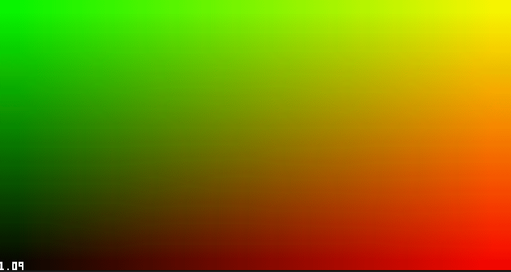

# Unity-ShaderCharDisplay
Convenient shader tool for displaying ascii characters as debug text in your shaders

## What is this?
Everyone who is working with postprocess shaders always struggle to debug pixel data, or intermediate values. To do so, you have really few tools in hand - return a color as screen color, or debug the pixels in Renderdoc, where you may read DXBC and debug line by line with it. If we have a tool to display realtime data inside shader, this could be really convenient.

Unity-ShaderCharDisplay provides a shadercommon file where you can port to any project you like, and it will display anything you like once you included it!

## How to use it?
Pretty simple, just add `PRINT_CHAR` or `PRINT_NUMBER` to anywhere you like inside your shader!

## Function Arguments
- PRINT_NUMBER
  - num: The number you want to display, can be `float`, `float2`, `float3` and `float4` form.
  - uv: Current uv of the canvas.
  - uvMins: The bottomleft corner of the text.
  - size: The height of your text.
  - screenAspect: The texture aspect of your canvas, usually it should be `xxx_TexelSize.w / xxx_TexelSize.z`
 
- PRINT_CHAR
  - ch: The character ascii you want to display, should be in range [0, 127]
  - uv: Current uv of the canvas.
  - uvMins: The bottomleft corner of the text.
  - size: The height of your text.
  - screenAspect: The texture aspect of your canvas, usually it should be `xxx_TexelSize.w / xxx_TexelSize.z`
